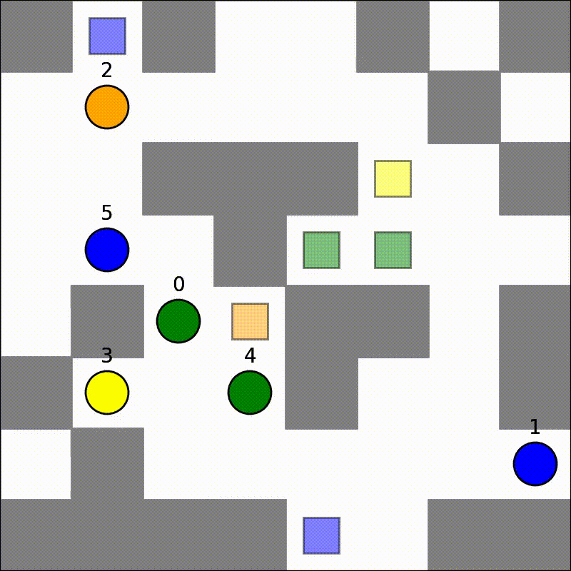
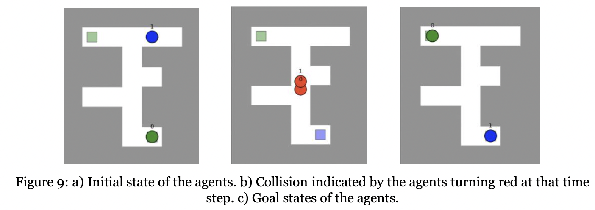
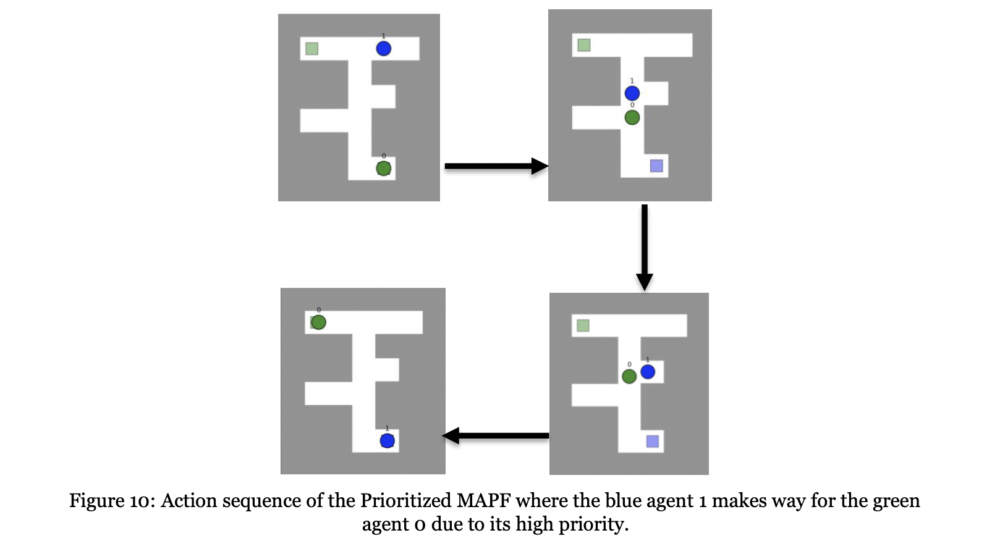
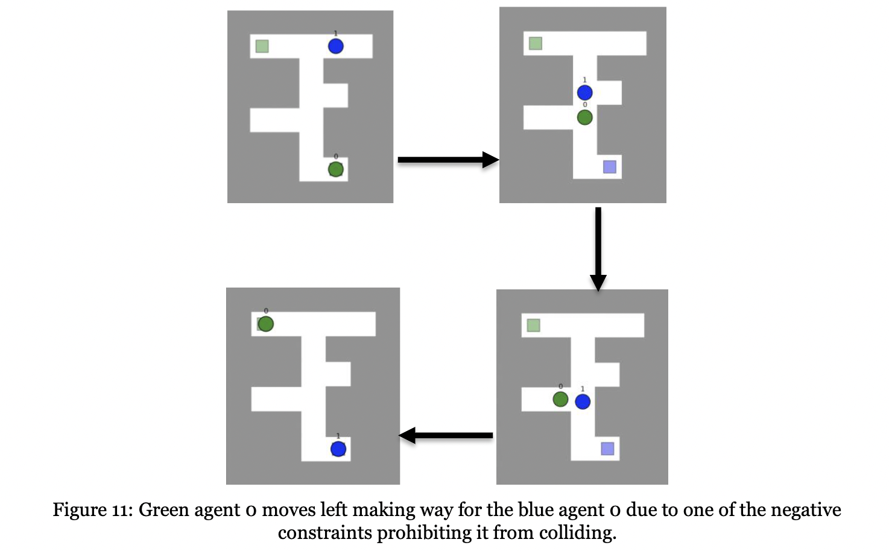
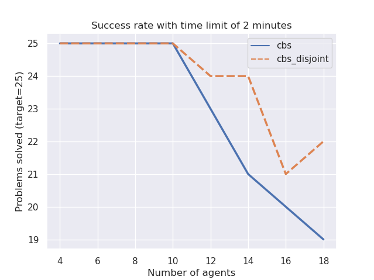
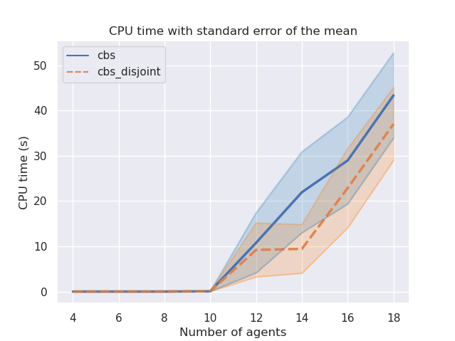
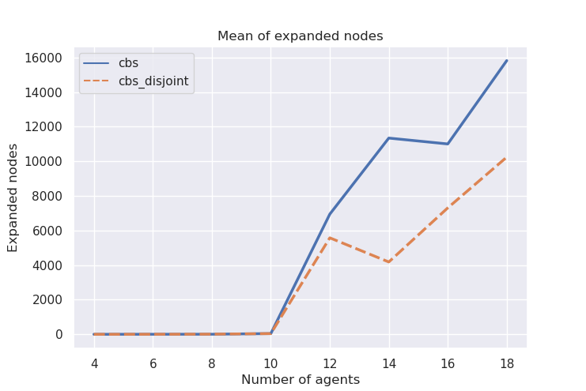
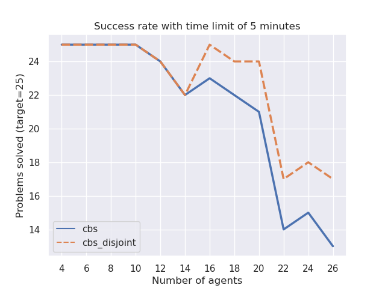
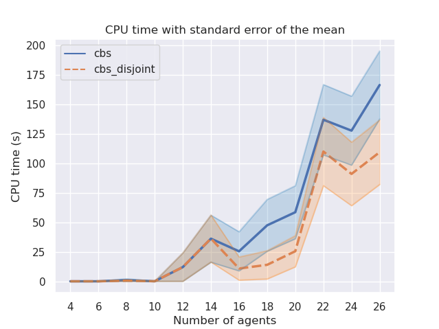

# Multi-Agent Path Finding (MAPF)
<!-- The MAPF (Multi-Agent Path Finding) is the problem of computing collision-free paths for a team of agents from their current locations to a given destination. In this repo you can find the solution of the assignment given by [Sven Koenig](http://idm-lab.org/project-p/project.html) that is composed of 5 tasks. I used the repository of [jzagoli](https://github.com/jzagoli) that has already implemented the tasks 1 to 3 included. Try the solution executing the following command (after installing requirements.txt): -->

Path  planning  and  efficient  management  within  the  limited  resources  is  very  significant.  In  a 
Travelling Salesman Problem(TSP), a single agent moves from one city to another city and reaches back to  the  same  city  and  the  TSP  algorithm  helps  to  plan  the  optimal  route  to  achieve  the  task.  In multiple real-world applications, a single agent is not sufficient to execute all the task and  even if the  single  agent  is  able  to  execute  the  performance  could  be  very  bad  even  after  following  an optimal path. Henceforth there is a need for the multi agent to execute the tasks in such applications.  The  biggest challenge  with  multi-agent  is  coordinating  the  agents  and  also  trying  to maintain the optimal solution. In this repo, our scope is only limited to two-agent co-ordination than finding the optimal path for the multi-agent. For this, We have adapted the assignment given by [Sven Koenig](http://idm-lab.org/project-p/project.html) that is composed of 5 tasks to compare our performance benchmarks.
<!-- You can find the solution of the assignment given by [Sven Koenig](http://idm-lab.org/project-p/project.html) that is composed of 5 tasks. -->
Sample output with a random Multi Agent Path Finder using CBS:
```bash
python run_experiments.py --disjoint --random --solver CBS
```
<p align="center">
    
</p>

### Independent planning using A*
```bash
python run_experiments.py --instance instances/exp0.txt --solver Independent
```

First, we compute the independent MAPF solver plans for all agents independently using A* search as  the  baseline  model.  Their  paths  do  not  collide  with  the  environment  but  are  allowed  to  collide with the paths of the other agents. Thus, there is a collision when the blue agent 1  moves towards its goal cell while the green agent 0 moves on top of it. In the Figure 9b, both agents turn red when this happens, and a warning is printed on the terminal notifying you about the details of the collision.  

Output for the following:
<p align="center">
    
</p>

### Space Time A* Planning

Here, we change the single agent solver to perform a space-time A* search that searches in cell-time 
space and returns a shortest path that satisfies a given set of constraints. Such constraints are 
essential for further MAPF solvers such as prioritized planning and CBS. We observe an identical 
behavioral as above.

### Prioritized Search Planning

```bash
python run_experiments.py --instance instances/exp0.txt --solver Prioritized
```

The  prioritized  MAPF  solver  finds  paths  for  all  agents,  one  after  the  other,  that  do  not  collide  with the  environment  or  the  already  planned  paths  of  the  other  agents.  To  ensure that  the  path  of  an  agent  does  not  collide  with  the  already  planned  paths  of  the  other  agents,  the function defined for A* receives as input a list of (negative) constraints compiled from their paths.

Output for the following:
<p align="center">
    
</p>

### Conflict Based Search Planning
```bash
python run_experiments.py --instance instances/exp0.txt --solver CBS
```

We detect collisions among agents, namely vertex collisions where two agents are in the same cell at the  same  time  step  and  edge  collisions  where  two  agents  move  to  the  cell  of  the  other  agent  at  the same time step. 

Output for the following:
<p align="center">
    
</p>

### Conflict Based Search Planning with Disjoint Split

<!-- ```bash
python run_experiments.py --instance instances/exp0.txt --solver CBS
``` -->

The target of this task is to implement the CBS (Conflict-Based Search) with Disjoint Splitting, that means (in a few words) to add the support of positive contraints to the CBS algorithm. The CBS algorithm use the negative contraints to indicate conflicts between agents, the idea of the positive contraints is to force agents to be in a certain position in the specified time.

### Benchmarks of the performance of MAPF solvers

<!-- In this task I will benchmark the performance of MAPF solvers,  -->
I chose to make a custom benchmark that is based on some random maps generated at runtime.

In our solution there are the following steps:
- Generate a random map
- Solve the map with the MAPF solver (CBS and CBS+DS)
- Increase the number of agents and repeat the process

#### 1 - Benchmark random
The benchmark is based on random maps generated at runtime with a number of agents that varies from 4 to 18 with a step of 2. For each number of agents the benchmark generate 25 maps and solve them with the MAPF solver. The time limit is set to 2 minutes and every cell of the map has the probability of 5% of being occupied.
The benchmark is executed with the following command (it can take hours to finish):

```bash
python run_experiments.py --benchmark random
```

After the execution you can see the results in the following command:

```bash
python plot_benchmark.py --plot random
```
A possible output is the following:
<p align="center">
    
    
    
</p>

#### 2 - Benchmark success

In this benchmark the map is a 20x20 matrix with obstacles distributed in the 5% of the map. The idea is to increase the number of agents (from 4 to 26 with step 2) and see if the algoritm can solve the problem in less than 5 minutes. For each number of agents the same map is used for 25 times, but the start and goal positions are randomly distributed (idea taken from this [paper](http://idm-lab.org/bib/abstracts/papers/icaps19a.pdf)).
To run this benchmark you need to launch the following command:

```bash
python run_experiments.py --benchmark success
```

When the benchmark is finished (it can take more then one hour) you can see the plots by typing the following command:

```bash
python plot_benchmark.py --plot success
```
<p align="center">
    
    
</p>

### Conclusion

In  this  project,  we  have  seen  various  research  in  the  field  of  multi-robot  path  planning  and  various applications. E-commerce industry taking a highly significant leverage of this technology especially in 
the domain of transportation and logistics. We implemented MAPF based search algorithms namely A*  based  search  algorithm,  Conflict  based  search  algorithms  and  priority-based  search  algorithm  to generate  various  cases  manifesting  the  behavior  of  the  agents  under  various  conditions  proposed  in the problem statement. 

The  configuration  space  for  path  planning  is  always  huge,  traditional  path planning  methods  search path  in  figuration  space  point  by  point  such  as  A*  searching  algorithm  and  Dijkstra  algorithm,  it  is time consuming. Although modified searching method such as sparse A* (SAS) improved the planning  speed  to  some  extent,  it  is  still  difficult  to  meet  the  demands  for real-time  path  planning. Also from the benchmarks, the algorithm CBS-DS runs much faster than the CBS algorithm and the number of nodes expanded is smaller. Future scope can be expanded towards Genetic  Algorithm  (GA) which might  meet  the  requirement.  GA  is  a  kind  of  evolutionary  algorithm  that obtains  optimal  solution  by  iterative  evolution  of  population.  In  the  iteration  process  of  getting the  optimal  solution,  plenty of  suboptimal  solutions  are  generated,  some  of  which  can  be  preserved as a choice of substitute if the suboptimal solutions were feasible paths. Henceforth, genetic algorithms can be a future scope of the current work in giving fast performance and optimal path. For complete report, please check out ([AI_Project_Report.pdf](pdf/AI_Project_Report.pdf)).